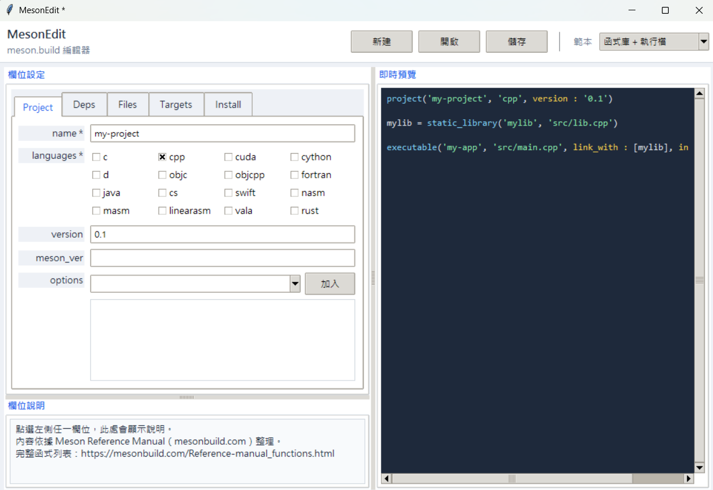

# MesonEdit

`meson.build` 互動式表單編輯器。支援 `project()` / `dependency()` / `files()` / `executable()` / `library()` / `static_library()` / `shared_library()` / `install_data()` / `install_headers()`（外加 `link_with` 最小擴充），每個欄位附 [Meson Reference Manual](https://mesonbuild.com/Reference-manual_functions.html) 說明，右側即時預覽產生的設定檔。

## 安裝

> GUI 使用 Python 內建 `tkinter`，無需額外安裝套件。

```bash
pip install pytest   # 僅開發/測試需要
```
---

## 介面說明



---

## 使用方式

```bash
# 開啟空白編輯器
python src/main.py

# 直接開啟指定 meson.build 進行編輯
python src/main.py path/to/meson.build

# Windows 捷徑
scripts\mesonedit.bat
```

快捷鍵：`Ctrl+N` 新建　`Ctrl+O` 開啟　`Ctrl+S` 儲存

---

## 介面說明

| 區域 | 說明 |
|------|------|
| **Header** | 新建 / 開啟 / 儲存按鈕；範本下拉選單 |
| **Project 分頁** | 專案名稱、語言、版本、meson_version、default_options（含常用預設快速加入） |
| **Dependencies 分頁** | 依賴池：列表 + 新增/刪除，右側編輯 name/modules/method/version/required |
| **Files 分頁** | `files()` 群組：定義 file 物件供 Targets 引用 |
| **Targets 分頁** | Target 列表：kind/name/sources/files 引用/dependencies/link_with/install |
| **Install 分頁** | install_data、install_headers（含 preserve_path）；未解析內容唯讀顯示 |
| **即時預覽（右）** | 同步顯示產生的 meson.build 內容 |
| **欄位說明（左下）** | 點選或 Tab 到任一欄位時顯示官方說明與範例 |
| **狀態列** | 顯示目前檔名；必填欄位未填時顯示 ⚠ 警告 |

---

## 範圍與限制

僅支援以下函式呼叫，存檔時固定格式重新產生（不保留原始排版/註解）：

- `project()`、`dependency()`、`files()`
- `executable()` / `library()` / `static_library()` / `shared_library()`（含 `link_with` 串接其他 target）
- `install_data()` / `install_headers()`（含 `preserve_path`）

開啟既有檔案時，無法辨識的語句（`if`/`foreach`、其他函式等）會整段保留在輸出檔案最後，並加註解標明，但無法在表單中編輯。**不支援** `subdir()` 多目錄專案、`test()`、控制流程。

---

## 內建範本

| 範本 | 適用情境 |
|------|---------|
| 空白 | 從零開始 |
| 單一執行檔 + 系統依賴 | 對應 round0-toolchain 現況：1 個 executable + 1 個 dependency + install |
| 函式庫 + 執行檔 | 一個 `static_library()` 被一個 `executable()` 用 `link_with` 引用 |
| 純安裝資料 | 只有 `install_data()`，無 build target |

## 測試

```bash
python -m pytest private/tests/ -v
```
