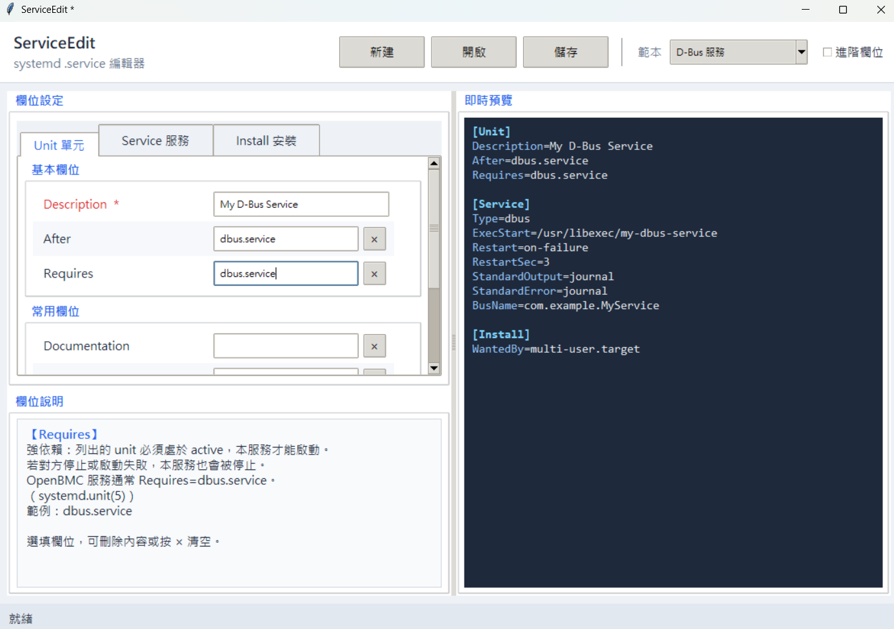

# ServiceEdit

systemd `.service` 互動式編輯器。每個欄位附官方文件說明與範例，右側即時預覽產生的設定檔。

## 安裝

```bash
pip install rich        # CLI 模式需要；GUI 模式只需 Python 標準函式庫
```

> GUI 使用 Python 內建 `tkinter`，無需額外安裝。

---

## 使用方式

```bash
# GUI 圖形介面（預設）
python src/main.py

# 直接開啟指定 .service 進行編輯
python src/main.py path/to/foo.service

# CLI 終端機互動模式
python src/main.py --cli

# Windows 捷徑
scripts\serviceedit.bat
```

快捷鍵：`Ctrl+N` 新建　`Ctrl+O` 開啟　`Ctrl+S` 儲存

---

## 介面說明



*點選或 Tab 到任一欄位，左下欄位說明面板即顯示官方文件說明。*

### 各區域功能

| 區域 | 說明 |
|------|------|
| **Header** | 新建 / 開啟 / 儲存按鈕；範本下拉選單；進階欄位切換 |
| **欄位設定（左上）** | Unit / Service / Install 三個分頁，欄位依「基本 / 常用 / 進階」分組 |
| **即時預覽（右）** | 同步顯示產生的 `.service` 內容；`[Section]` 與 `key=` 有語法上色 |
| **欄位說明（左下）** | 點選或 Tab 到任一欄位時，顯示官方說明、可選值、預設值與範例 |
| **狀態列** | 顯示目前檔案名稱；有必填欄位未填時顯示 ⚠ 警告 |

### 欄位說明

- `*` 標記為必填欄位（Description、ExecStart、Type、WantedBy）
- 選填欄位右側有 `×` 按鈕可一鍵清空
- 勾選「進階欄位」可顯示 WatchdogSec、LimitNOFILE、CapabilityBoundingSet 等
- Type=dbus 時自動顯示 BusName 欄位；Type=forking 時自動顯示 PIDFile 欄位
- 儲存前若有未填必填欄位，會彈出確認對話框

---

## 內建範本

| 範本 | 適用情境 |
|------|---------|
| 空白 | 從零開始 |
| 簡單常駐服務 | 最常見的 daemon 模式（Type=simple + Restart=on-failure） |
| 降權使用者服務 | 以非 root 使用者執行，搭配 PrivateTmp 沙箱 |
| 通知就緒服務 (notify) | 程序呼叫 `sd_notify("READY=1")` 後才視為啟動 |
| D-Bus 服務 | 取得 D-Bus BusName 後才視為就緒（Type=dbus） |
| Oneshot 初始化腳本 | 開機執行一次、不常駐（Type=oneshot + RemainAfterExit=yes） |
| 傳統 Forking Daemon | fork 後父程序退出（Type=forking + PIDFile） |
| 網路相關服務 | 等待網路完全就緒後才啟動（network-online.target） |

---

## 涵蓋欄位

| Section | 欄位 |
|---------|------|
| `[Unit]` | Description, Documentation, After, Before, Wants, Requires, Conflicts, ConditionPathExists |
| `[Service]` | Type, ExecStart, ExecStop, ExecReload, ExecStartPre, ExecStartPost, Restart, RestartSec, User, Group, WorkingDirectory, Environment, EnvironmentFile, StandardOutput, StandardError, SyslogIdentifier, KillSignal, TimeoutStartSec, TimeoutStopSec, RemainAfterExit, PIDFile, BusName, WatchdogSec, LimitNOFILE, PrivateTmp, CapabilityBoundingSet, ReadWritePaths, Nice |
| `[Install]` | WantedBy, RequiredBy, Also, Alias |

欄位說明依據 `systemd.service(5)` / `systemd.unit(5)` / `systemd.exec(5)` 整理。

---

## CLI 模式

加 `--cli` 改用 Rich 終端機互動模式，逐欄位填寫後預覽並儲存：

```
  python src/main.py --cli

  ── [Unit] ──
  Description *
    服務的人類可讀名稱。
    範例: My Background Service
  Description (Enter 跳過): My Sensor Service
  ...
```

適合在純終端機環境（SSH）中使用。
